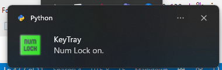

 
# KeyTray

## Overview

`KeyTray` is a small utility tool designed to help you keep track of your keyboard's Num Lock state. The application resides in your system tray and allows you to easily see whether Num Lock is active or not. No more awkward number typing mishaps!

## Features

- Real-time Num Lock state tracking
- Simple and lightweight
- Easy-to-understand UI

## Launch

Launch the application with the following command:

    pythonw app.py

NB: pythonw is used to launch the application in the background. If you want to see the console output, use python instead.

NB: Use pyinstaller to create a standalone executable.
    
    pyinstaller --windowed --onefile --icon=resources/active.ico --add-data resources/*.ico:resources KeyTray.py

NB: Use NSSM to launch the application as a service.

## Usage

After launch, `KeyTray` will automatically appear in your system tray.

- **Green icon**: Num Lock is ON
- **Red icon**: Num Lock is OFF

To close the application, right-click on the system tray icon and select "Exit".

## Contributing

We welcome contributions! Please see the `CONTRIBUTING.md` file for details on how to get involved.

## License

This project is licensed under the MIT License. See the `LICENSE.md` file for details.
